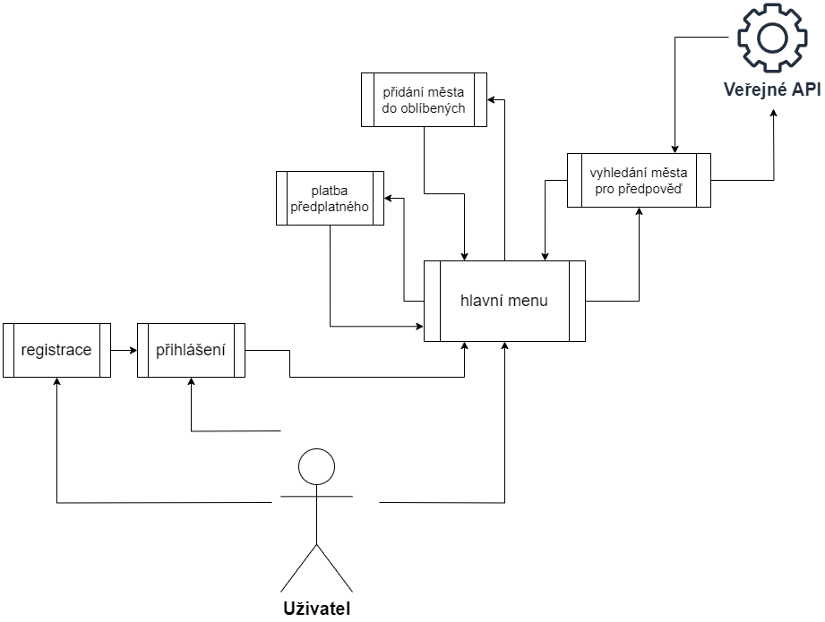
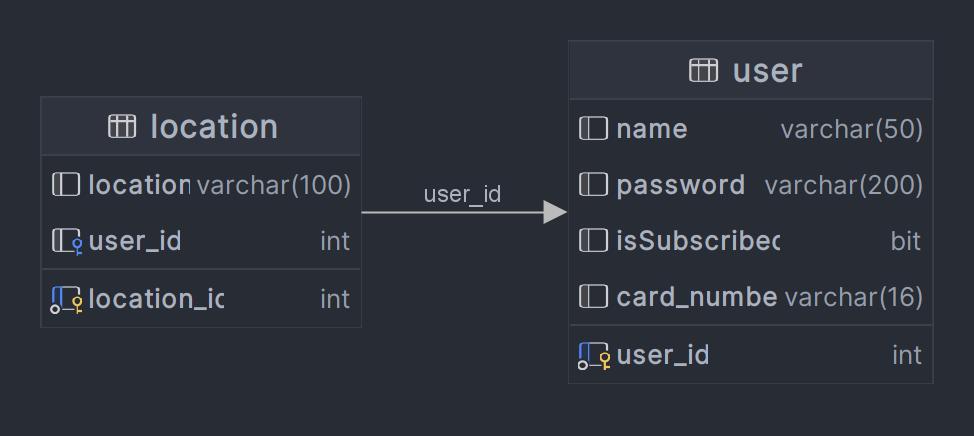

# Systém pro předpověď počasí

---
### Dokument Specifikace Požadavků
#### Vytvořil: Filip Král, 10.04.2024

---
## Obecný popis aplikace

Cílem této aplikace je implementovat systém pro předpověď počasí, který bude umožňovat hledání aktuálního počasí, jeho 
předpověď i historii. Bude umožňovat vytvořit si vlastní účet a zaplatit si předplatné, které uživateli umožní ukládat
si oblíbená místa a vidět tak i jejich historii v předpovědi. Aplikace bude dostupná jak na PC, tak i na mobilních telefonech.
Aplikace bude umožňovat graficky uživatelské rozhraní na úrovni webového prohlížeče.
\
\
Samotná data počasí budou dostupná z veřejně dostupného API, které v různých formátech poskytuje komplexní data o počasí.

---
## Využité technologie

- Webový prohlížeč: s jádrem Chromium, doporučená verze 120.xxx a výše
- HW specifikace: 4GB RAM, 4GB uložiště
- Programovací jazyk: Python 3.12
- Nadstavba: Flask
- internetové připojení
- Databáze: MySQL
- API - https://www.weatherapi.com

---
## Graficky uživatelské rozhraní - GUI

Aplikace bude dostupná k využívání na úrovni jakéhokoliv webového prohlížeče s podporovaným jádrem zmíněným výše.
Aplikace je v anglickém jazyce. Celý systém se bude skládat z několik dílčích webových stránek:

1. registrační stránka
2. přihlašovací stránka
3. hlavní strana s předpověďmi
   4. informace o aktuálním počasí v aktuálním místě, aktuální počasí o vybraném místě
   5. zobrazení oblíbených měst, předpověď pro následující dny, historie pro dny předchozí
6. stránka s platební bránou
   7. v registraci je potřebné zadat debetní / kreditní kartu

Uživatel může v grafickém rozhraní provádět následující akce:

1. registrační stránka
   2. volba registrace, pro úspěšnou registraci je potřeba zadat uživatelské jméno, čísla debetní / kreditní karty, heslo a heslo znovu pro ověření
3. přihlašovací stránka
   4. volba přihlášení pomocí uživatelského jména a hesla
4. hlavní menu
   5. uživatel si může bez přihlášení vyhledat jeho město, pro které chce vidět aktuální předpověď, v prvním načtení uvidí předpověď pro jeho aktuální polohu
   6. uživatel může s přihlášením vykonávat stejné úkony, jako kdyby byl bez přihlášení
   7. pokud bude chtít uživatel zažádat o předplatné, je nutné vybrat volbu nahoře v menu - **PAY NOW!**, ve které bude poté vyzván k zaplacení předplatného
   8. následně může přidávat vyhledaná města do oblíbených, v tuto chvíli uvidí pro každé město předpověď na další 3 dny
   9. pokud si uživatel vybere město a přidá si ho do oblíbených, uvidí i historii počasí 7 dozadu

---
## Chybové stavy

Uživatel bude při chybně zadaných hodnotách upozorňován vhodnými prostředky tak, aby mu napomáhali ke správné orientaci 
a ke správnému vyplnění požadovaných informací k správné funkčnosti systému.
\
\
Příklady chybových stavů pro uživatele:

- **špatně zadaná hodnota do vstupního pole** - systém zabrání potvrzení požadavku pro další
zpracování chodu aplikace a upozorní uživatele na špatně zadanou hodnotu

Příklady chybových stavů pro administrátora systému:

- **nemožnost připojení systému k internetu** – systém nebude nadále pokračovat do té doby,
dokud nebude moci úspěšně využívat funkčnosti použitého API
- **neaktivní databáze** - systém se nespustí do té doby, dokud nebude ověřeno, že je
databáze aktivní a může s ní nadále pracovat

---
## UseCase diagram

---
## Návrh databáze

### Popis databáze

- user
  - user_id: primární klíč [PK]
  - name: uživatelské jméno
  - password: heslo pro uživatelský účet
  - isSubscribed: hodnota 0/1, 1 - TRUE = uživatel má předplatné
  - card_number: číslo debetní / kreditní karty
- location
  - location_id: primární klíč [PK]
  - location: název města
  - user_id: id uživatele, který má toto město jako oblíbené, cizí klíč [FK]

---
## Časová náročnost pro realizaci
Odhaduji, že časová náročnost pro realizaci by se rovnala 15 - 20 hodinám práce.
